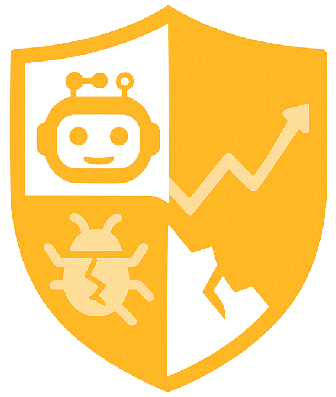
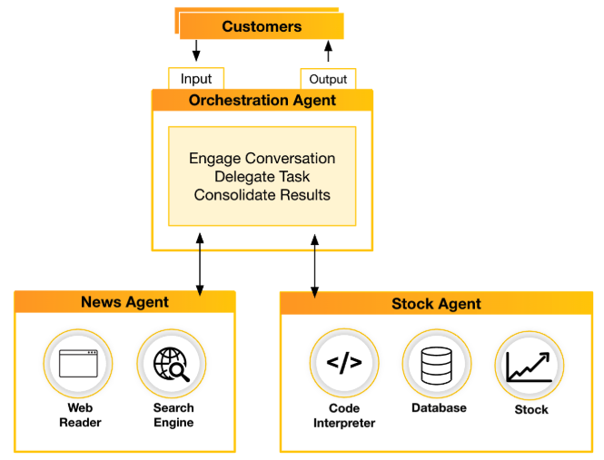

To investigate the security risks associated with AI agents, we developed a multi-user, multi-agent **Stock Advisory Assistant** using two popular open-source agent frameworks: [CrewAI](https://github.com/crewAIInc/crewAI) and [AutoGen](https://github.com/microsoft/autogen). Both implementations are functionally identical, using the same instructions, language models, and tools.

For a comprehensive analysis, please refer to the full research on the [Unit 42 blog](https://unit42.paloaltonetworks.com/agentic-ai-threats).

# Stock Advisory Assistant

The assistant comprises three cooperating agents: the **orchestration agent**, **news agent**, and **stock agent**.

* **Orchestration Agent**  
  Manages user interactions by interpreting requests, delegating tasks to the appropriate agents, consolidating outputs, and delivering the final response.

* **News Agent**  
  Retrieves and summarizes recent financial news related to specific companies or industries.

* **Stock Agent**  
  Assists users with managing their stock portfolios. It supports operations such as viewing transaction history, executing trades, retrieving historical stock data, and generating performance visualizations. 

## Sample Queries

The assistant can respond to a wide range of user queries, such as:

* Show the news and sentiment about Palo Alto Networks

* Show the news and sentiment about the agriculture industry

* Show the stock history of Palo Alto Networks over the past four weeks

* Show my portfolio

* Plot the performance of my portfolio over the past 30 days

* Recommend a rebalancing strategy based on current market sentiment

* Buy two shares of Palo Alto Networks

* Display my transactions from the past 60 days

## Environment Setup

Because CrewAI and AutoGen have distinct dependencies and runtime requirements, we recommend using **separate Python virtual environments** for each implementation. Refer to their respective documentation for setup instructions:

* [CrewAI Documentation](./CrewAI/README.md)
* [AutoGen Documentation](./AutoGen/README.md)

It is important to clarify that **CrewAI** and **AutoGen** themselves are **not vulnerable**. The security risks highlighted in our setup are not tied to a specific framework or model, but rather arise from **misconfigurations or insecure design choices made during agent development**.

